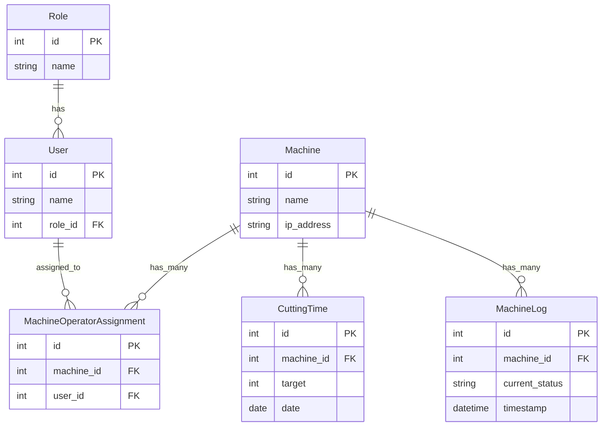

# Ringkasan Dokumentasi Aplikasi Monitoring Mesin

Dokumen ini merangkum arsitektur, fitur, dan cara kerja aplikasi monitoring mesin berdasarkan dokumentasi proyek yang ada.

## 1. Gambaran Umum & Arsitektur

Aplikasi ini adalah sistem monitoring mesin produksi full-stack yang memungkinkan pemantauan _real-time_, manajemen pengguna, dan transfer file ke mesin.

**Teknologi Utama:**

- **Frontend**: Vue.js 3
- **Backend**: Node.js dengan Express.js
- **Database**: PostgreSQL dengan Sequelize ORM
- **Komunikasi Real-time**: MQTT (Mesin ke Server) & WebSockets (Server ke Klien)
- **Process Manager**: PM2

### Arsitektur Backend

Server dirancang dengan arsitektur dua proses untuk stabilitas dan performa:

1.  **API Server (`app.js`)**: Menangani permintaan HTTP dari klien, otentikasi, dan koneksi WebSocket.
2.  **MQTT Listener (`mqtt.js`)**: Berjalan terpisah, bertugas khusus untuk menerima data dari mesin via MQTT dan menyimpannya ke database.

**Alur Data:**

```
Mesin -> MQTT Broker -> MQTT Listener (Server) -> Database (PostgreSQL) -> API Server -> WebSocket -> Frontend (Dashboard)
```

## 2. Fitur Utama

- **Manajemen Pengguna & Akses**:
  - Otentikasi berbasis token (JWT).
  - Manajemen akses berdasarkan peran (Role-Based Access Control).
- **Pemantauan Mesin Real-time**:
  - Menerima dan mencatat status mesin (`running`, `stop`, `alarm`) dari MQTT.
  - Menampilkan histori log dalam bentuk timeline interaktif (`Timeline2View.vue`).
  - Menghitung data produktivitas seperti `Cutting Time`.
- **Transfer File (FTP)**:
  - Mengunggah file program (G-code/NC) dari server ke mesin.
  - Melihat daftar dan menghapus file di mesin.
- **Tugas Otomatis (Cron Jobs)**:
  - Membuat entri `CuttingTime` harian secara otomatis.
  - Menyalin konfigurasi shift dari hari sebelumnya.
  - Membersihkan file log dan file sementara secara berkala.
- **Pelaporan**:
  - Mengunduh laporan log mesin dalam format bulanan.

## 3. Struktur Database (ERD)

Diagram berikut menggambarkan hubungan antar tabel utama di dalam database.



## 4. Endpoint API Utama

Semua endpoint berada di bawah prefix `/api`.

- `/users`: Registrasi, login, dan manajemen pengguna.
- `/roles`: Mendapatkan daftar peran pengguna.
- `/machines`: Mendapatkan data mesin, log, `cutting-time`, dan melakukan operasi FTP (transfer, list, delete file).
- `/settings`: Mengelola konfigurasi aplikasi seperti jadwal shift harian.

## 5. Setup & Menjalankan Proyek

Langkah-langkah ringkas untuk menjalankan server:

1.  **Install Dependensi**:
    ```bash
    cd server && pnpm install
    ```
2.  **Konfigurasi**: Salin file `.env.example` menjadi `.env` dan sesuaikan kredensial. Atur koneksi database di `config/config.json`.
3.  **Setup Database**: Buat database di PostgreSQL, lalu jalankan migrasi.

    ```bash
    # Membuat semua tabel berdasarkan model
    pnpx sequelize-cli db:migrate

    # (Opsional) Mengisi data awal
    pnpx sequelize-cli db:seed:all
    ```

4.  **Jalankan Server**:
    - **Mode Development**: `pnpx nodemon app.js`
    - **Mode Produksi**: Gunakan PM2 dengan file `ecosystem.config.cjs`. `pm2 start ecosystem.config.cjs`
