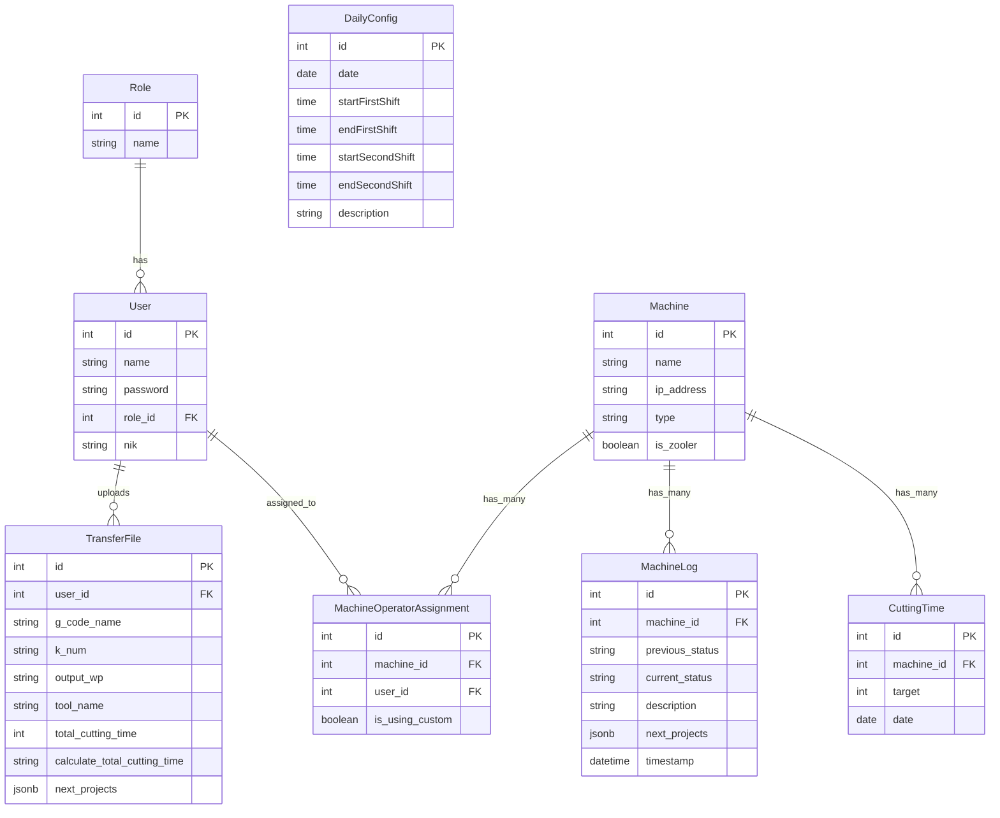

# Dokumentasi Aplikasi Server

Berikut adalah dokumentasi mengenai arsitektur dan fungsionalitas dari server aplikasi Anda.

## 1. Arsitektur dan Teknologi

Aplikasi backend ini dibangun menggunakan **Node.js** dengan beberapa komponen utama:

*   **Framework**: Express.js untuk menangani API request dan routing.
*   **Database**: PostgreSQL sebagai database, dengan **Sequelize** sebagai ORM (Object-Relational Mapping) untuk mempermudah interaksi dengan database.
*   **Komunikasi Real-time**:
    *   **MQTT**: Untuk komunikasi M2M (Machine-to-Machine). Mesin-mesin di lantai produksi mengirimkan data (seperti status, log, dll.) ke server melalui MQTT broker.
    *   **WebSockets**: Untuk komunikasi Server-ke-Client. Server mengirimkan pembaruan data secara real-time ke dashboard frontend, sehingga UI dapat menampilkan status mesin terkini tanpa perlu refresh.
*   **Process Manager**: PM2 digunakan untuk menjaga agar semua proses server (API, MQTT, dll.) berjalan secara terus-menerus.

## 2. Komponen Utama

Server ini terdiri dari dua proses Node.js utama yang berjalan secara bersamaan:

1.  **API Server (`app.js`)**
    *   Menyediakan RESTful API untuk operasi CRUD (Create, Read, Update, Delete) pada data seperti Mesin, User, Role, Log Mesin, dan konfigurasi harian.
    *   Menangani koneksi WebSocket dari klien (frontend) untuk mengirim pembaruan data secara langsung.
    *   Menyajikan file statis, termasuk build dari aplikasi frontend.

2.  **MQTT Handler (`mqtt.js`)**
    *   Proses ini berjalan terpisah dan bertugas untuk terhubung ke MQTT broker.
    *   Mendengarkan (subscribe) topik MQTT tertentu dimana mesin mengirimkan data mereka.
    *   Ketika pesan diterima, proses ini akan mem-parsing data, menyimpannya ke database (misalnya membuat `MachineLog`), dan kemudian memberi sinyal ke API Server (melalui WebSocket) untuk meneruskan pembaruan ke semua klien yang terhubung.

## 3. Fitur Penting Lainnya

*   **Transfer File FTP**: Terdapat fungsionalitas untuk mentransfer file (kemungkinan besar G-code atau file NC) ke dan dari mesin menggunakan protokol FTP (`FTPController.js`).
*   **Manajemen User & Role**: Sistem otentikasi dan otorisasi berbasis role (peran) untuk membatasi akses ke fitur-fitur tertentu.
*   **Tugas Terjadwal (Cron Job)**: File `helpers/cronjob.js` mengindikasikan adanya tugas yang berjalan secara otomatis pada waktu tertentu, seperti membersihkan file log lama atau membuat entri data harian.

---

## Penjelasan `ecosystem.config.cjs`

File ini adalah file konfigurasi untuk **PM2**, sebuah process manager untuk aplikasi Node.js. PM2 memastikan aplikasi Anda tetap berjalan (online) dan dapat me-restart secara otomatis jika terjadi crash.

Konfigurasi Anda menjalankan beberapa proses, namun yang paling penting terkait backend adalah dua proses Node.js:

1.  `express-server`: Ini adalah proses yang menjalankan file `app.js`, yaitu server API utama Anda. Semua permintaan HTTP dari frontend akan ditangani di sini.
2.  `mqtt-broker`: Proses ini menjalankan file `mqtt.js`. Ini adalah listener MQTT Anda.

**Mengapa ada dua proses Node.js untuk backend?**

Ini adalah praktik yang baik untuk memisahkan tugas.
*   **Kestabilan**: Jika server API (`app.js`) perlu di-restart atau mengalami crash, listener MQTT (`mqtt.js`) tetap berjalan. Ini memastikan tidak ada data dari mesin yang hilang. Begitu pula sebaliknya.
*   **Skalabilitas & Performa**: Setiap proses berjalan di thread-nya sendiri, sehingga tugas berat pada satu proses (misalnya, pemrosesan data MQTT yang kompleks) tidak akan memperlambat proses lainnya (misalnya, responsivitas API).

Singkatnya, `ecosystem.config.cjs` mengatur orkestrasi dari semua layanan yang dibutuhkan aplikasi Anda agar dapat berjalan secara bersamaan dan andal.

---

## ERD (Entity-Relationship Diagram) Database

Berikut adalah representasi visual dari struktur dan hubungan antar tabel di database Anda, dibuat berdasarkan model Sequelize.

### Penjelasan Relasi:

*   **User & Role**: Satu `Role` bisa dimiliki oleh banyak `User`, tapi satu `User` hanya punya satu `Role` (one-to-many).
*   **User & TransferFile**: Satu `User` bisa mengunggah banyak `TransferFile` (one-to-many).
*   **Machine & MachineLog**: Satu `Machine` memiliki banyak `MachineLog` (one-to-many).
*   **Machine & CuttingTime**: Satu `Machine` bisa memiliki banyak entri `CuttingTime` (one-to-many).
*   **User, Machine & MachineOperatorAssignment**: Ini adalah tabel penghubung (junction table) yang mencatat `User` (operator) mana yang ditugaskan ke `Machine` mana. Ini menyelesaikan hubungan many-to-many antara User dan Machine.
*   **DailyConfig**: Tabel ini sepertinya tidak memiliki relasi langsung dan berfungsi sebagai tabel konfigurasi global untuk jadwal shift. 